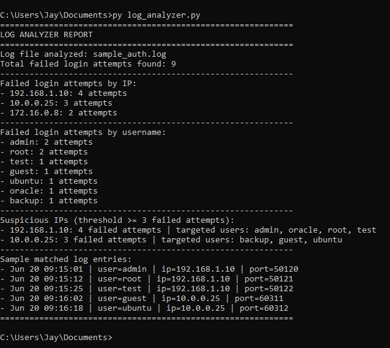

# Python Log Analyzer

A Python-based cybersecurity project that analyzes authentication log entries and detects suspicious failed SSH login attempts.

## Purpose
This project was built to understand how security analysts can review authentication logs to identify repeated failed login attempts, suspicious IP addresses, and targeted usernames.

## Features
- Parses auth-style log entries using Python regex.
- Detects failed SSH login attempts.
- Counts failed attempts by IP address.
- Counts failed attempts by username.
- Flags suspicious IPs based on a failed-attempt threshold.
- Displays matched log entries for quick security review.

## How It Works
The script reads a sample authentication log file and uses a regular expression to extract:
- Timestamp
- Username
- Source IP address
- Port number

It then:
- Counts failed attempts from each IP.
- Counts how many times each username was targeted.
- Flags suspicious IPs with repeated failed login attempts.
- Prints a simple security report in the terminal.

## Example Use
This project simulates a basic security monitoring task similar to reviewing Linux authentication logs for suspicious SSH login activity.

## Sample Output
The script identifies repeated failed SSH login attempts, counts suspicious activity by IP and username, and flags IP addresses that cross a failed-attempt threshold.

## Ethical Note
This project is for educational purposes only. It uses sample log data and does not interact with live systems.

## Concepts Practiced
- Python regex
- Log parsing
- SSH failed login analysis
- Suspicious IP detection
- Counting and aggregation using `Counter` and dictionaries

## Future Improvements
- Export results to CSV
- Detect successful logins separately
- Add time-based attack windows
- Support multiple log formats
- Build a GUI version

## Author
Jay Prakash  
GitHub: [jayprakash-tech](https://github.com/jayprakash-tech)
